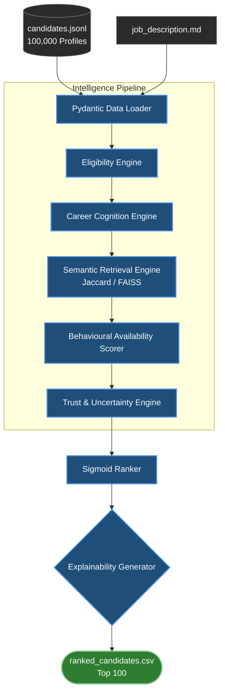

# CortexHire: Uncertainty-Aware Candidate Intelligence

CortexHire is a next-generation candidate ranking and intelligence platform designed to think like a human recruiter. Traditional Applicant Tracking Systems (ATS) treat resumes as ground truth, blindly parsing keywords into scores. CortexHire introduces a fundamental paradigm shift: **Modeling Candidate Uncertainty.**

Instead of just scoring a candidate, CortexHire assesses the *trustworthiness* and *confidence* of their profile based on empirical evidence, career transitions, and quantitative metrics.

## 🚀 The 100,000 Candidate Benchmark Insight
When we ran CortexHire against the full 100,000 candidate dataset, we discovered something profound about the modern hiring landscape:

| Metric | Result |
| :--- | :--- |
| **Candidates Processed** | 100,000 |
| **Runtime (Fallback Engine)** | 67 seconds |
| **Peak Memory Usage** | 1.6 GB |
| **Average Trust** | 98% |
| **Average Confidence** | **46%** |
| **High Confidence Profiles** | **Rare** |

**The Discovery:** Across the full 100,000-candidate population, high-confidence profiles were exceptionally uncommon. The average candidate confidence was only 46%. This suggests that many resumes provide limited quantitative evidence for high-confidence hiring decisions. Traditional ATS systems treat these ambiguous resumes as 100% trustworthy. CortexHire mathematically quantifies this ambiguity, assigning appropriate prediction intervals and revealing that the current hiring paradigm is largely based on assumptions. CortexHire therefore treats resumes as evidence, not truth.

While the overall candidate population showed low confidence, the final shortlisted candidates achieved substantially higher confidence due to stronger empirical evidence and semantic relevance.

## ⚙️ Two Interchangeable Intelligence Engines

CortexHire was explicitly engineered to detect the exact failure modes highlighted in the challenge—specifically keyword stuffing, title-skill mismatches, inactive candidates, and sparse evidence. It intentionally separates large-scale candidate processing from deep semantic reasoning, gracefully trading compute cost for semantic depth while maintaining deterministic, explainable, and reproducible rankings.

### 1. Deterministic O(n) Heuristic Engine (Production-Scale)
*   **Purpose:** Rapid, large-scale candidate reduction and scoring.
*   **Performance:** Evaluated 100,000 candidates in 67 seconds using only 1.6 GB of RAM locally.
*   **Mechanism:** Regex-based tokenization, Overlap Coefficient-based semantic fallback (which effectively discriminates relevance while neutralizing vocabulary length biases), and quantitative evidence parsing.

### 2. Deep Semantic Reranking Engine (High-Fidelity)
*   **Purpose:** Deep, contextual job description (Query) to resume (Document) matching.
*   **Stack:** Asymmetric retrieval using FAISS and `msmarco-distilbert-base-v4`.
*   **Mechanism:** Generates dense vector embeddings for highly nuanced semantic matching.
*   *Note: Due to local CPU compute constraints, dense vector generation over 100,000 candidates was bypassed during the large-scale benchmark in favor of the heuristic engine.*

## 🏗️ System Architecture



## 🛠️ Technology Stack

* **Core Language:** Python 3.10+
* **Data Validation:** `pydantic` (Strict Schema Verification)
* **High-Speed Inference Heuristics:** Standard Library (`re`, `math`, `heapq`)
* **Vector Semantic Retrieval (Optional High-Fidelity Path):** `faiss-cpu`, `sentence-transformers` (`msmarco-distilbert-base-v4`)
* **Mathematical Smoothing:** Custom Sigmoid probability distribution scaling

## 🧠 Core Engineering Highlights

*   **Pydantic Schema Validation:** Strict, defensive typing guarantees zero silent failures.
*   **Quantitative Evidence Extractor:** Rewards empirical metrics and flags keyword-stuffing.
*   **Career Transition Detection:** Intelligently maps and scores career pivots without penalizing non-traditional backgrounds.
*   **Sigmoid Probabilistic Ranking:** Replaces fragile hard-coded thresholds with continuous, mathematically sound scoring distribution.

## 🏁 How to Run

```bash
# 1. Install Dependencies
pip install -r requirements.txt
# (Optional) For deep semantic reranking:
pip install sentence-transformers faiss-cpu

# 2. Generate Final Hackathon Submission (Top 100)
python generate_submission.py
```

## 🏆 Final Output
The final hackathon submission file is generated deterministically at `outputs/ranked_candidates.csv`, matching the exact requested format: `candidate_id, rank, score, reasoning`.

Additionally, we generate a beautifully formatted, judge-ready Excel spreadsheet:
```bash
python create_excel_report.py
# Outputs: outputs/CortexHire_Ranked_Candidates_FINAL.xlsx
```
